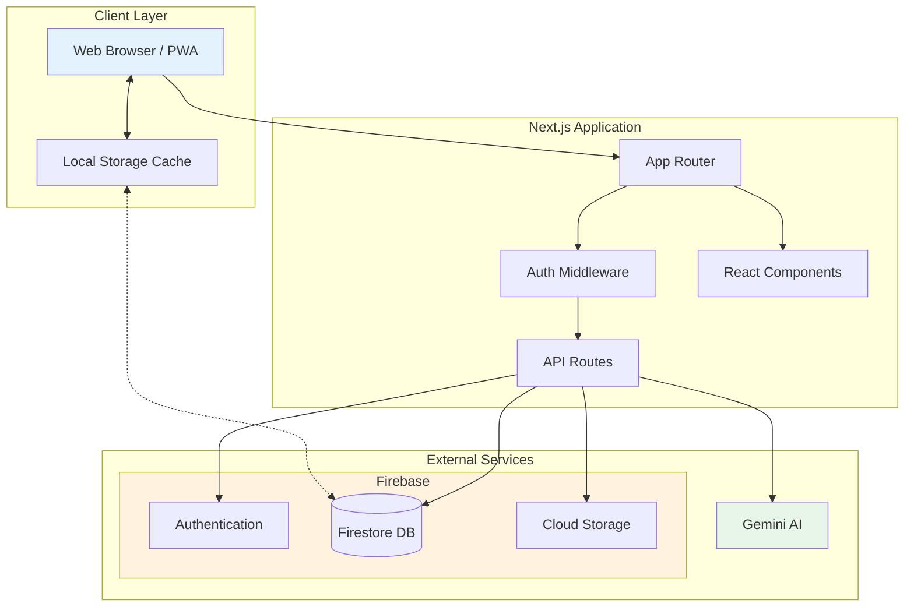
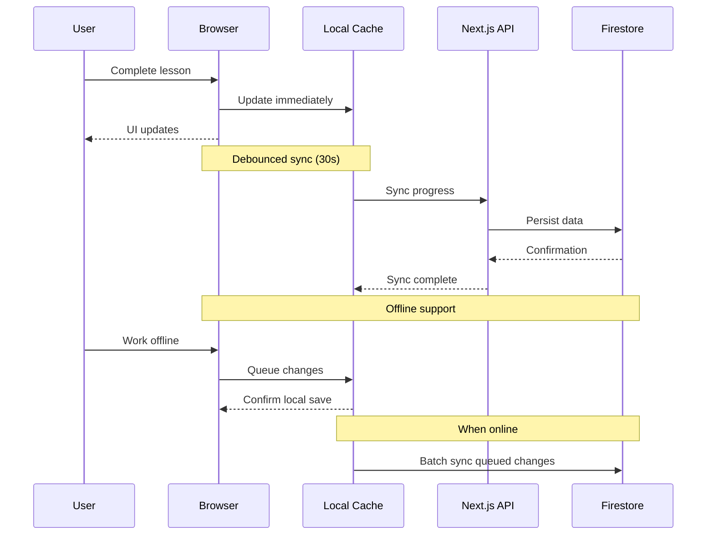

# Gakuen

A modern, full-stack e-learning platform built with Next.js 15, Firebase, and TypeScript.

    

## Overview

Gakuen is anlearning management system designed to deliver interactive courses with AI-powered tutoring, real-time progress tracking, and a comprehensive admin dashboard for content management.

## System Architecture



## Features

### For Students

- Interactive course viewer with video, article, and code-based lessons
- AI-powered tutoring assistant (Gemini 3.0)
- Progress tracking with completion certificates
- Multi-language support with real-time translation
- Mobile-responsive PWA design

### For Administrators

- Drag-and-drop course builder with live preview
- Component-based lesson editor (CMS)
- User management with role-based access control
- Analytics dashboard with API usage tracking
- Coupon and subscription management
- Notification system

### Technical Highlights

- Server-side rendering with Next.js App Router
- Firebase Authentication (Google, Email/Password)
- Firestore database with offline-first architecture
- Hybrid storage with local caching and background sync
- Rate limiting and DDoS protection
- Comprehensive test coverage (Vitest)

## Tech Stack

| Category | Technologies |
|----------|-------------|
| Framework | Next.js 15 (App Router) |
| Language | TypeScript 5 |
| Database | Firebase Firestore |
| Authentication | Firebase Auth |
| Styling | Tailwind CSS |
| AI | Google Gemini 3.0 |
| Testing | Vitest |
| Deployment | Vercel / Self-hosted |

## Getting Started

### Prerequisites

- Node.js 18 or higher
- npm, yarn, or pnpm
- Firebase project with Firestore enabled

### Installation

1. Clone the repository

   ```bash
   git clone https://github.com/yourusername/gakuen.git
   cd gakuen
   ```

2. Install dependencies

   ```bash
   npm install
   ```

3. Configure environment variables

   Copy `.env.local.example` to `.env.local` and fill in your credentials:

   ```bash
   cp .env.local.example .env.local
   ```

4. Start the development server

   ```bash
   npm run dev
   ```

5. Open [http://localhost:3000](http://localhost:3000) in your browser

### Environment Variables

| Variable | Description |
|----------|-------------|
| `NEXT_PUBLIC_FIREBASE_API_KEY` | Firebase API key |
| `NEXT_PUBLIC_FIREBASE_AUTH_DOMAIN` | Firebase auth domain |
| `NEXT_PUBLIC_FIREBASE_PROJECT_ID` | Firebase project ID |
| `FIREBASE_ADMIN_PRIVATE_KEY` | Firebase Admin SDK private key |
| `GEMINI_API_KEY` | Google Gemini API key |

See `.env.local.example` for the complete list.

## Project Structure

```
gakuen/
├── app/                    # Next.js App Router pages
│   ├── (admin)/           # Admin dashboard routes
│   ├── (auth)/            # Authentication pages
│   ├── (checkout)/        # Payment flows
│   ├── (dashboard)/       # Student dashboard
│   └── api/               # API routes
├── components/            # React components
│   ├── cms/              # Course editor components
│   ├── layout/           # Layout components
│   └── ui/               # UI primitives
├── lib/                   # Utilities and services
│   ├── api/              # API utilities
│   ├── firebase/         # Firebase client
│   └── storage/          # Hybrid storage system
├── __tests__/            # Test suites
└── public/               # Static assets
```

## Data Flow



## Scripts

| Command | Description |
|---------|-------------|
| `npm run dev` | Start development server |
| `npm run build` | Build for production |
| `npm run start` | Start production server |
| `npm run test` | Run test suite |
| `npm run lint` | Run ESLint |

## Deployment

### Vercel (Recommended)

1. Push your repository to GitHub
2. Import the project in Vercel
3. Add environment variables in the Vercel dashboard
4. Deploy

### Self-Hosted

1. Build the application

   ```bash
   npm run build
   ```

2. Start the production server

   ```bash
   npm run start
   ```

## Documentation

For detailed setup and configuration guides, see the [docs](docs/) directory:

- [Firebase Setup](docs/setup/firebase-setup.md)
- [Firebase Token Auth](docs/setup/firebase-token-auth.md)
- [Admin Configuration](docs/setup/make-admin.md)
- [Security Notes](docs/security-notes.md)

## License

This project is licensed under the MIT License. See the [LICENSE](LICENSE) file for details.

## Contributing

Contributions are welcome. Please open an issue first to discuss proposed changes.
