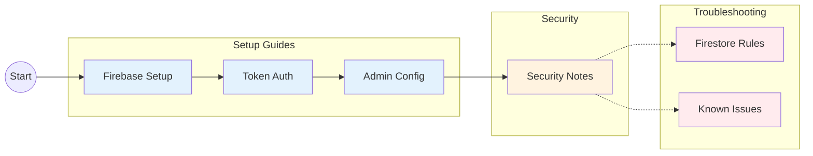

# Documentation

Quick links to all project documentation.

## Documentation Map

## Setup Guides

| Document | Description |
|----------|-------------|
| [Firebase Setup](setup/firebase-setup.md) | Configure Firebase project and environment |
| [Firebase Token Auth](setup/firebase-token-auth.md) | Implement secure token-based authentication |
| [Make Admin](setup/make-admin.md) | Grant administrative privileges to users |

## Security

| Document | Description |
|----------|-------------|
| [Security Notes](security-notes.md) | Security guidelines, best practices, and authentication recommendations |

## Troubleshooting

| Document | Description |
|----------|-------------|
| [Firestore Rules Fix](troubleshooting/firestore-rules-fix.md) | Resolve common Firestore permission issues |
| [Known Issues](troubleshooting/known-issues.md) | Known bugs and their workarounds |
