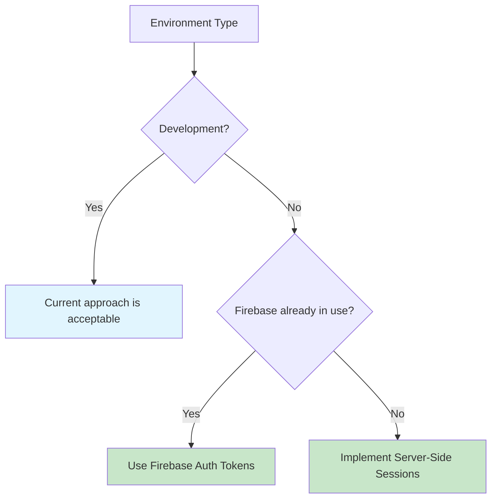

# Security Notes: Session Storage and Authentication

## Overview

This document outlines security considerations for session storage and provides recommendations for production-ready authentication implementations.

## Current Implementation Analysis

### localStorage Vulnerabilities

| Risk | Description |
|------|-------------|
| XSS Exposure | Accessible via JavaScript, vulnerable to cross-site scripting attacks |
| Client Modification | Users can modify values directly in DevTools |
| No httpOnly Protection | Cannot be protected from malicious scripts |
| Role Tampering | Users can alter their role value (e.g., change to "admin") |

### Current Cookie Implementation

| Risk | Description |
|------|-------------|
| XSS Exposure | Also accessible via JavaScript (same vulnerability as localStorage) |
| Client Modification | Can be modified in DevTools |
| No httpOnly Flag | Set client-side, so cannot use httpOnly protection |

## Security Concern

**Client-side session storage (whether localStorage or client-set cookies) is fundamentally insecure for authorization.**

An attacker can:

1. Open browser DevTools
2. Execute: `localStorage.setItem('user', '{"role":"admin"}')`
3. Refresh the page
4. Gain unauthorized admin access

## Recommended Solution: httpOnly Cookies with Server-Side Sessions

### Implementation Architecture

```mermaid
sequenceDiagram
    participant Client
    participant Server
    participant Firebase
    
    Client->>Server: POST /api/auth/login (credentials)
    Server->>Firebase: Verify credentials
    Firebase-->>Server: User data
    Server->>Server: Create session token
    Server-->>Client: Set-Cookie: session=token; HttpOnly; Secure
    
    Note over Client,Server: Subsequent requests
    
    Client->>Server: Request with cookie
    Server->>Server: Validate session token
    Server-->>Client: Protected resource
```

### Server-Side Session Management

```typescript
// app/api/auth/login/route.ts
export async function POST(request: Request) {
  const { email, password } = await request.json();
  
  // Verify credentials
  const user = await verifyUser(email, password);
  
  // Create server-side session
  const sessionToken = await createSession(user);
  
  // Set httpOnly cookie (cannot be accessed by JavaScript)
  return new Response(JSON.stringify({ success: true }), {
    headers: {
      'Set-Cookie': `session=${sessionToken}; HttpOnly; Secure; SameSite=Lax; Path=/; Max-Age=604800`
    }
  });
}
```

### Security Benefits

| Feature | Benefit |
|---------|---------|
| httpOnly Flag | JavaScript cannot read the cookie, preventing XSS token theft |
| Server Validation | Every request is validated server-side |
| Tamper Resistance | Tokens cannot be modified client-side |
| Middleware Integration | Middleware can read and validate httpOnly cookies |

## Implementation Options

### Option A: Current Approach (Development Only)

**Use Case:** Development and demos where users are trusted

| Pros | Cons |
|------|------|
| Fast implementation | Any user can escalate to admin |
| Simple debugging | Not suitable for production |

### Option B: Server-Side Sessions (Recommended for Production)

**Use Case:** Production applications with untrusted users

| Pros | Cons |
|------|------|
| Maximum security | Requires session database (Redis, PostgreSQL) |
| Industry standard | Additional infrastructure |

### Option C: Firebase Auth Tokens (Recommended Middle Ground)

**Use Case:** Production applications leveraging Firebase infrastructure

| Pros | Cons |
|------|------|
| Built-in security | Firebase dependency |
| No session database | Token refresh complexity |
| Server-side validation | |

## Recommendation



- **Development:** Current approach is acceptable
- **Production:** Switch to Firebase Auth tokens or implement proper server-side sessions

For Firebase token-based authentication implementation, see [Firebase Token Auth Setup](setup/firebase-token-auth.md).
