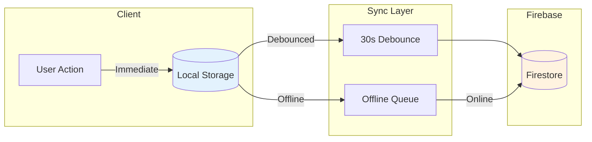

# Gakuen Firebase Setup Guide

## Overview

This guide covers the complete Firebase configuration process for the Gakuen platform, including project creation, authentication setup, Firestore configuration, and security rules deployment.

## Quick Start

### Step 1: Create Firebase Project

**Estimated time: 2 minutes**

1. Navigate to [Firebase Console](https://console.firebase.google.com/)
2. Click **Add Project** or **Create a project**
3. Enter project name: `gakuen-platform` (or your preferred name)
4. Disable Google Analytics (optional for development)
5. Click **Create Project**

### Step 2: Enable Authentication

1. In Firebase Console, navigate to **Authentication** > **Get Started**
2. Select **Email/Password** > Enable > Save

### Step 3: Create Firestore Database

1. Navigate to **Firestore Database** > **Create database**
2. Select **Start in test mode** > Next
3. Choose your preferred region > Enable

### Step 4: Obtain Firebase Configuration

1. Go to **Project Settings** (gear icon)
2. Scroll to "Your apps" section > Click Web icon (`</>`)
3. Register app with name: `gakuen-web`
4. Copy the `firebaseConfig` object

### Step 5: Configure Environment

Create `.env.local` in the project root:

```bash
# Copy from template
cp .env.local.example .env.local
```

Add your Firebase configuration values:

```env
NEXT_PUBLIC_FIREBASE_API_KEY=AIzaSy...
NEXT_PUBLIC_FIREBASE_AUTH_DOMAIN=gakuen-platform.firebaseapp.com
NEXT_PUBLIC_FIREBASE_PROJECT_ID=gakuen-platform
NEXT_PUBLIC_FIREBASE_STORAGE_BUCKET=gakuen-platform.appspot.com  
NEXT_PUBLIC_FIREBASE_MESSAGING_SENDER_ID=123456789
NEXT_PUBLIC_FIREBASE_APP_ID=1:123456789:web:abc123

# Enable Firebase integration
NEXT_PUBLIC_USE_FIREBASE=true
```

### Step 6: Deploy Firestore Security Rules

Navigate to **Firebase Console** > **Firestore Database** > **Rules** and deploy:

```javascript
rules_version = '2';
service cloud.firestore {
  match /databases/{database}/documents {
    // Users collection
    match /users/{userId} {
      allow read: if request.auth != null;
      allow write: if request.auth.uid == userId;
    }
    
    // Progress collection  
    match /progress/{userId} {
      allow read, write: if request.auth.uid == userId;
    }
  }
}
```

Click **Publish** to deploy the rules.

---

## Testing Configuration

### Testing Without Firebase

Set the following in `.env.local`:

```env
NEXT_PUBLIC_USE_FIREBASE=false
```

The application will use local storage only. Demo accounts remain functional.

### Testing With Firebase

Set the following in `.env.local`:

```env
NEXT_PUBLIC_USE_FIREBASE=true
```

**Verification steps:**

1. Login with demo account: `student@gakuen.edu` / `student123`
2. This creates a user record in Firebase (on first login)
3. Progress synchronizes to Firebase every 30 seconds
4. Verify data in Firebase Console

---

## Hybrid Storage Architecture



| Action | Local Storage | Firebase | Notes |
|--------|--------------|----------|-------|
| Login | Cache user | Authenticate | Immediate |
| Complete Lesson | Update immediately | Sync after 30s | Debounced |
| Logout | Clear cache | Sign out | Sync pending first |
| Offline | Works | Queued | Syncs when online |

---

## Development Guidelines

| Guideline | Recommendation |
|-----------|----------------|
| Development Mode | Keep Firebase disabled (`USE_FIREBASE=false`) |
| Production | Enable Firebase integration |
| Monitoring | Use Firebase Console > Usage tab |
| Free Tier Limits | 50K reads/day, 20K writes/day |

---

## Troubleshooting

### Error: Firebase not initialized

**Checklist:**

- Verify `.env.local` exists with correct values
- Restart development server after modifying environment variables

### Error: Permission denied

**Checklist:**

- Confirm Firestore rules are published
- Verify user is authenticated

### Data not syncing

**Checklist:**

- Check browser console for errors
- Verify `NEXT_PUBLIC_USE_FIREBASE=true`
- Inspect Firebase Console for data presence
