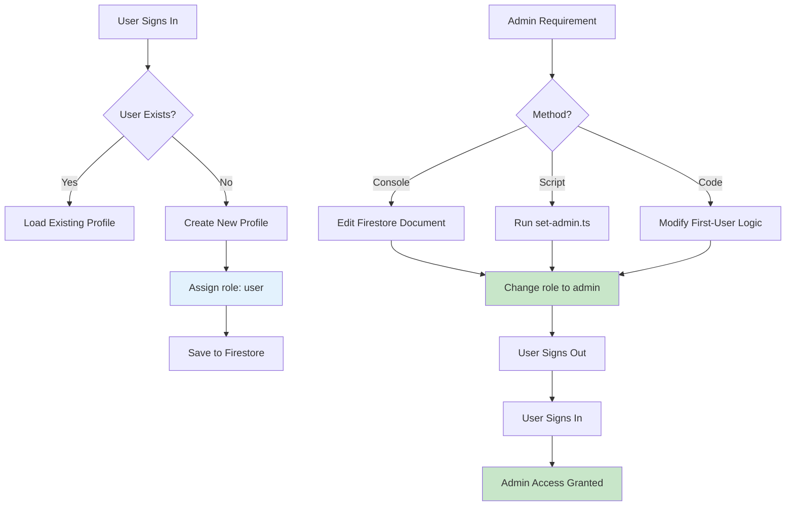

# Administrator Role Configuration

## Overview

This guide explains how to grant administrative privileges to users in the Gakuen platform.

## Method 1: Firebase Console (Recommended)

### Step 1: Access Firebase Console

1. Navigate to [Firebase Console](https://console.firebase.google.com/)
2. Select your project
3. Go to **Firestore Database**

### Step 2: Locate User Document

1. Click on the `users` collection
2. Find your user document (identified by UID)

### Step 3: Modify Role

1. Click on your user document
2. Locate the `role` field
3. Change value from `"user"` to `"admin"`
4. Save changes

### Step 4: Refresh Application

1. Perform a hard refresh (Ctrl+Shift+R)
2. Sign out and sign back in
3. Administrative access should now be available

---

## Technical Context

In [`lib/firebase/auth.ts`](file:///c:/Users/Xiao%20Fan/Coding/ELearn/gakuen/lib/firebase/auth.ts#L72):

```typescript
role: "user",  // Line 72 - All new users default to "user" role
```

This default behavior is intentional for security purposes. Automatic admin assignment would create a significant security vulnerability.

---

## Method 2: First-User Admin (Alternative)

For development environments where the first user should automatically receive admin privileges, modify the `signInWithGoogle()` function:

```typescript
// If new user, create profile
if (!profile) {
    // Check if this is the first user (make them admin)
    const usersCount = await getUsersCount(); // Implementation required
    
    const newUser: User = {
        id: credential.user.uid,
        email: credential.user.email || "",
        name: credential.user.displayName || "User",
        role: usersCount === 0 ? "admin" : "user", // First user = admin
        avatar: credential.user.photoURL || undefined,
        enrolledCourses: [],
        completedLessons: [],
        createdAt: new Date().toISOString(),
    };
    
    await createUserProfile(newUser);
    profile = newUser;
}
```

> **Note:** The Firebase Console method is faster for initial setup and does not require code modifications.

---

## Role Assignment Flow


