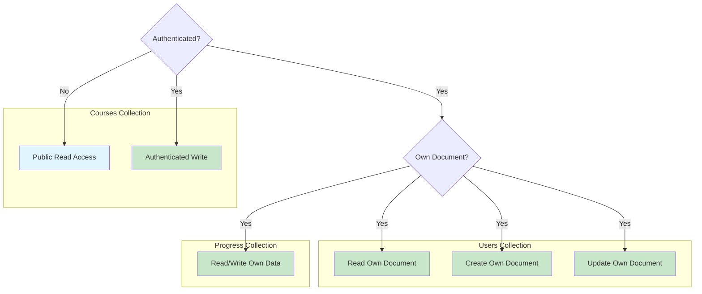

# Firestore Permission Fix: Auto-Registration

## Problem Description

**Error:** `FirebaseError: Missing or insufficient permissions`

**Root Cause:** Firestore security rules are blocking user document creation during the auto-registration process.

---

## Context

The auto-registration functionality is implemented in [`lib/firebase/auth.ts`](file:///c:/Users/Xiao%20Fan/Coding/ELearn/gakuen/lib/firebase/auth.ts):

When signing in with Google (lines 63-83), the system:

1. Checks if the user document exists
2. If not, creates it automatically
3. Persists to Firestore via `createUserProfile()`

**Issue:** Firestore security rules reject the write operation.

---

## Solution: Update Firestore Security Rules

### Step 1: Access Firebase Console

1. Navigate to [Firebase Console](https://console.firebase.google.com/)
2. Select your project
3. Go to **Firestore Database** > **Rules** tab

### Step 2: Deploy Updated Rules

Replace existing rules with the following configuration:

```javascript
rules_version = '2';
service cloud.firestore {
  match /databases/{database}/documents {
    
    // Users collection - allow users to create and manage their own document
    match /users/{userId} {
      // Authenticated users can read their own document
      allow read: if request.auth != null && request.auth.uid == userId;
      
      // Users can create their own document on first sign-in
      allow create: if request.auth != null && request.auth.uid == userId;
      
      // Users can update their own document
      allow update: if request.auth != null && request.auth.uid == userId;
    }
    
    // Courses collection - public read, authenticated write
    match /courses/{courseId} {
      allow read: if true;  // Public access for course browsing
      allow write: if request.auth != null;  // Authenticated users only
      
      // Course metadata subcollection
      match /metadata/{document=**} {
        allow read: if true;
        allow write: if request.auth != null;
      }
    }
    
    // User progress tracking
    match /progress/{userId} {
      allow read, write: if request.auth != null && request.auth.uid == userId;
    }
  }
}
```

### Step 3: Publish Rules

1. Click the **Publish** button
2. Wait for confirmation message

---

## Verification

1. Sign out if currently authenticated
2. Click **Sign In with Google**
3. Select your Google account
4. Verify no errors occur
5. Navigate to **Firestore** > `users` collection > Confirm your document exists

---

## Rules Summary



| Rule | Permission |
|------|------------|
| User Document Creation | Allowed for authenticated users creating their own document |
| User Document Read/Update | Allowed only for document owner |
| Course Read | Publicly accessible |
| Course Write | Requires authentication |
| Progress Tracking | Read/write limited to document owner |

---

## Troubleshooting

### Check Console Errors

Open browser console (F12) and examine specific error messages.

### Verify Firebase Configuration

Confirm `.env.local` contains all required Firebase credentials:

```bash
NEXT_PUBLIC_FIREBASE_API_KEY=...
NEXT_PUBLIC_FIREBASE_AUTH_DOMAIN=...
NEXT_PUBLIC_FIREBASE_PROJECT_ID=...
# etc.
```

### Confirm Authentication Status

This error occurs **after** successful Google sign-in. If Google OAuth fails, investigate API key configuration.

### Force Refresh

After updating rules, perform a hard refresh (Ctrl+Shift+R) and retry authentication.

---

## Security Considerations

These rules are designed for development with production-ready security principles:

| Principle | Implementation |
|-----------|----------------|
| User Data Isolation | Users can only access their own data |
| Authenticated Writes | Course modifications require authentication |
| No Anonymous Writes | Write operations require valid credentials |
| Appropriate Read Scope | Public data is accessible; private data is protected |

### Production Recommendations

For production deployment, consider implementing:

- Admin role checks for course creation/modification
- Field validation rules for required data
- Rate limiting for write operations
